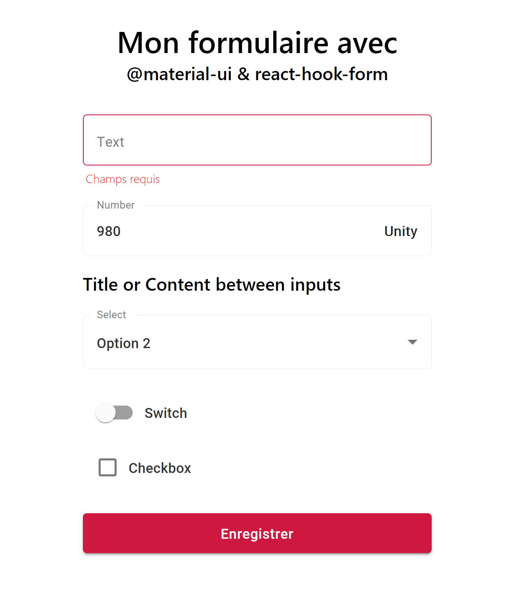

This is a reusable expandable form based on [@material-ui](https://material-ui.com) and [react-hook-form](https://react-hook-form.com)

### `npm install`
Install npm packages 

### `npm start`
Runs the app in the development mode.
Open http://localhost:3000 to view it in the browser.



### `Example of use`

```JSX
import React, { useState } from 'react';
import Form from './components/Form/Form';

const App = props => {

  const [_pending, _setPending]=useState()
  
  const onSubmit = values => {
    //handling submit
    
    _setPending(true)
    setTimeout(()=>{
      _setPending(true);
      _setPending(false)
    }, 3000)
  }
  
 const formInputs = [
    {
      name: 'text',
      label: 'Text',
      validation: { required: 'Champs requis' }
    },
    {
      name: 'number',
      label: "Number",
      type: 'number',
      validation: { required: "Champs requis" },
      endAdornment: <span'>Unity</span>
    },
    {
      content : <div>Title or Content between inputs</div>
    },
    {
      name: 'select',
      label: "Select",
      type: 'select',
      validation: { required: "Champs requis" },
      options: (values) => [{value : 1, name : "Option 1"},{value : 2, name : "Option 2"},{value : 3, name : "Option 3"}]
    },
    
    {
      name: 'switch',
      label: 'Switch',
      type: 'switch'
    },
    {
      name: 'checkbox',
      label: 'Checkbox',
      type: 'check'
    },
  ]
  return(
    <Form 
        title={<div>Mon formulaire avec @material-ui & react-hook-form</div>}
        inputs={formInputs}
        onSubmit={onSubmit}
        submitText='Enregistrer'
        pending={_pending}
      />
  )
}
```

